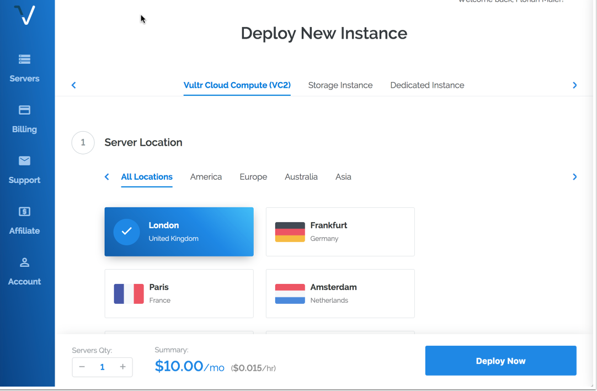
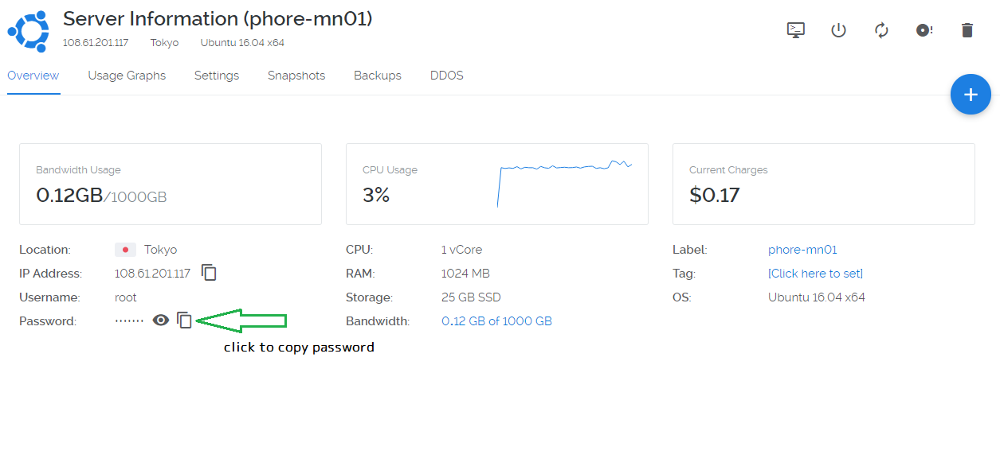

# Uzlocoin Masternode VPS Installation

This masternode installation script vastly simplifies the setup of a Uzlocoin masternode running on a virtual private server (VPS), and it also adds a number of other powerful features, including:

* IPv6 Support
* Installs 1-100 (or more!) Uzlocoin masternodes in parallel on one VPS, with individual uzlocoin.conf and data directories
* It can install masternodes for other coins on the same VPS as Uzlocoin
* 100% auto-compilation and 99% of configuration on the masternode side of things
* Automatically compiling from the latest Uzlocoin release tag, or another tag can be specified
* Some security hardening is done, including firewalling and a separate user, increasing security
* Automatic startup for all masternode daemons

Some notes and requirements:

* Script has only been tested on a Vultr VPS, but should work almost anywhere where IPv6 addresses are available
* Currently only Ubunto 16.04 Linux is supported
* This script needs to run as root or with sudo, the masternodes will and should not!

This project was forked from https://github.com/masternodes/vps. @marsmensch (Florian) is the primary author behind this VPS installation script for masternodes. If you would like to donate to him, you can use the BTC address below

**Have fun, this is crypto after all!**

```
BTC  33ENWZ9RCYBG7nv6ac8KxBUSuQX64Hx3x3
```

# Install guide on vultr

## How to get VPS server

For new masternode owners, **Vultr** is recommended as a VPS hosting provider, but other providers that allow direct root SSH login access and offer Ubunto 16.04 may work.

You can use the following referral link to sign up with Vultr for VPS hosting:

<a href="https://www.vultr.com/?ref=7316561"></a>

## Deploy a new system

First, create a new VPS by clicking that small "+" button.


## Location choice

You can choose any location. You may wish to have it hosted in a city/country near you, or choose a different area to help with the global decentralization of the Uzlocoin masternode network.



## Linux distribution (Ubuntu 16.04 LTS)

Select Ubuntu 16.04.


## VPS size

The 25 GB SSD / 1024MBB Memory instance is enough for 2-3 masternodes. You may need more memory as the Uzlocoin blockchain grows over time, or if you want to run more masternodes.


## Activating additional features (IPv6)

Toggle "Enable IPv6" to activate that feature--at Vultr there is no additional cost for this.


You may wish to enable DDOS Protection to protect your masternodes against a potential denial of service attack, especially if you are running multiple masternodes from one VPS. Vultr charges an additional fee for this.

## Hostnames & number of VPS

Choose how many instances you want and click "Deploy Now".


## Installation of PuTTY as SSH client (Windows)
If you are running your wallet from Windows, install PuTTY while the server is being set up. You can download PuTTY from here: http://www.putty.org/. Skip this step if you are using a Mac--you will use the built in Terminal application instead.

Once PuTTY is installed, return to the Vultr dashboard to get the login details by clicking on the ... to the right of your server, and select Server Details.

## Accessing your VPS via SSH

Copy your password for SSH access from the server details page.


Now open PuTTY to add the server.


Enter the IP address in the Host Name field, and enter the server name you wish to use for this VPS (e.g., MN01) to Saved Sessions. Click save.

Click the open button. When the console has opened, click Yes in the PuTTY Security Alert box.


Now enter your server login details provided in your Vultr account.
You cannot Ctrl+V to paste in the console. Either right click the mouse or type shift+insert (sometimes
on keyboard it will just be INS key)

User: root
Password: (paste or type password)

When you paste it will not display, so don't try to paste again.
Just paste once and press Enter.

For Mac users, open Terminal (e.g., Press Command-Space and type Terminal and press Enter). Then type:

```
ssh -l root <IP address>
```
## Install Masternode

Login to your newly installed node as "root".


Enter this command to copy the Masternode installation script and install a single Uzlocoin Masternode:

```bash
git clone https://github.com/uzlocoin/vps.git && cd vps && ./install.sh -p uzlocoin
```

If you have your masternode private key, please use this (you can generate masternode private key with Step 2 below).

```bash
git clone https://github.com/uzlocoin/vps.git && cd vps && ./install.sh -p uzlocoin -k **PRIVATE KEY**
```
Using this command, you can skip "Configure masternode configuration files" below, because the command above adds the masternode private key to the masternode configuration files.

This prepares the system and installs the Uzlocoin Masternode daemon. This includes downloading the latest Uzlocoin masternode release, creating a swap file, configuring the firewall, and compiling the Uzlocoin Masternode from source code. This process takes about 10-15 minutes.


While that is underway, go back to your local desktop and open uzlocoin-qt.

### More complex situations (ignore if you are installing a single masternode on a new VPS)

If you wish to install more than one masternode on the same VPS, you can add a -c parameter to tell the script how many to configure, so for example this would install three Uzlocoin masternodes (all entered on one line):

```bash
git clone https://github.com/uzlocoin/vps.git && cd vps && ./install.sh -p uzlocoin -c 3
```

If you already have your masternode private keys, you can add them as shown below (all entered on one line):

```bash
git clone https://github.com/uzlocoin/vps.git && cd vps && ./install.sh -p uzlocoin -c 3 --key **PRIVATE KEY 01** --key2 **PRIVATE KEY 02** --key3 **PRIVATE KEY 03**
```
Using this command, you can skip the step for "Configure masternode configuration files", because the command above adds the masternode private keys to the masternode configuration files.


If you are upgrading your masternode(s) to a new release, you should first remove the old version of the VPS script so that the new one you download is tagged with the latest version, and then you add a -u parameter to upgrade existing nodes:

```bash
rm -rf /root/
```
```bash
git clone https://github.com/uzlocoin/vps.git && cd vps && ./install.sh -p uzlocoin -u
```

The project is configured to use the latest official release of the Uzlocoin masternode code, and we will update this project each time a new release is issued, but without downloading the latest version of this project and using the -u parameter, the script will not update an existing Uzlocoin node that is already installed.

## Configure Uzlocoin Wallet
### Step1 - Create Collateral Transaction
Once the wallet is open on your local computer, select the 'Receive' tab and generate a new receive address for the amount of 10,000 UZL. You may label it however you want to identify your masternode rewards (e.g., Uzlocoin-MN-1). This label will show up in your transactions each time you receive a block reward.


Click the Request payment button, and copy the address.


Now go to the ‘Send' tab, paste the copied address, and send *exactly* 10,000 UZL to it in a single transaction. This is the collateral transaction that will be locked and paired with your new masternode. If you are setting up more than one masternode at a time, repeat this process for each one.

*You must wait for at least one confirmation (approx. 1 minute) on the blockchain before moving on to the next step!*


### Step 2 - Local Masternode Setup

After waiting for at least one confirmation on the collateral transaction we just created, select the 'Masternodes' tab and click on the 'Add Masternode' button.


Under ‘Alias Name’ enter the name of your Masternode (in my case it is ‘Uzlocoin-MN-1’). Then click both ‘Autofill Privkey’ and ‘Autofill Outputs’; this will automatically fill the ‘Priv Key’, ‘Output’ and ‘Output ID’ fields.

The ‘VPS IP’ field will be blank, we will get to that in a moment.

## End of installations

When the script finishes, it will look similar to this:


You only have a few steps remaining to complete your Masternode configuration.

## Configure Masternode Configuration Files

Since this installation method supports multiple masternodes, the Uzlocoin configuration files have a node number added to them (e.g., uzlocoin_n1.conf, uzlocoin_n2.conf), stored in the /etc/masternodes directory. If you have a single masternode on the VPS, you will only need to edit /etc/masternodes/uzlocoin_n1.conf.

To open uzlocoin_n1.conf for editing, enter these commands:

```sudo apt-get install nano```

```nano /etc/masternodes/uzlocoin_n1.conf```

You will see something similar to this:


Copy the IP from ```masternodeaddr=``` (highlighted in red in the image above) and paste it into the ‘VPS IP’ field of the local wallet Masternode setup. Every field should now be full. Copy your ‘Priv Key’ (we will need this soon) and click ‘OK’.


The next step will be to add your masternode private key.

## Add Masternode Private Key

Back in Putty, you only need to change the masternode private key. (We recommend using IPv6 which is the default, but if you choose IPv4 when you ran the installation script, please edit #NEW_IPv4_ADDRESS_FOR_MASTERNODE_NUMBER to your VPS IP address). 

Replace HERE_GOES_YOUR_MASTERNODE_KEY_FOR_MASTERNODE_uzlocoin_1 with the copy of your ‘Priv Key’ from the local wallet.


Once you have your masternode private key entered, press ‘Ctrl+X’ to exit, press ‘Y’ to save when prompted, and press ‘Enter’ to exit.

Once you exit the configuration screen, you can start your masternode.

## Start your Masternode

A script for starting all masternodes on the VPS has been created at /usr/local/bin/activate_masternodes_uzlocoin.sh. Run this command after your masternode configuration written above. To do this, enter:

```/usr/local/bin/activate_masternodes_uzlocoin```

The masternode daemons will start and begin loading the Uzlocoin Blockchain.

## Check Syncing Status of Masternode

The masternode cannot complete activation until it is fully synced with the Uzlocoin Blockchain network.

To check the status of your masternode, please enter the command below in the VPS terminal. If you have multiple masternodes on the same VPS, you can change n1 to n2 etc. to check the status of each one.

```/usr/local/bin/uzlocoin-cli -conf=/etc/masternodes/uzlocoin_n1.conf getinfo```

The output will look like this:

```{
  "version": 1010000,
  "protocolversion": 7002,
  "walletversion": 61000,
  "balance": 0.00000000,
  "privatesend_balance": 0.00000000,
  "blocks": 176209,
  "timeoffset": 0,
  "connections": 44,
  "proxy": "",
  "difficulty": 42882.54964804553,
  "testnet": false,
  "moneysupply" : 11814171.53907114,
  "zUZLsupply" : {
      "1" : 263.00000000,
      "5" : 135.00000000,
      "10" : 500.00000000,
      "50" : 700.00000000,
      "100" : 1300.00000000,
      "500" : 5000.00000000,
      "1000" : 11000.00000000,
      "5000" : 90000.00000000,
      "total" : 108898.00000000
  },
  "keypoololdest" : 1507302593,
  "keypoolsize" : 1001,
  "paytxfee" : 0.00000000,
  "relayfee" : 0.00010000,
  "staking status" : "Staking Not Active",
  "errors" : ""
}
```

We're looking at the blocks, and need that to be the latest block in the blockchain. You can check your local wallet to see the latest block by hovering over the green check mark.


Once your masternode has synced up to the latest block, go to next step. The syncing process may take 15-30 minutes, or more, as the Uzlocoin Blockchain grows. You can keep checking progress with the command above, by pressing the ‘Up’ arrow and the ‘Enter’ key to repeat it (or by pasting the command in again).

## Start Masternode

When your Masternode is fully synced on the VPS, go back to the ‘Masternode’ tab of the local wallet and click ‘Start Alias’. 


Click ‘Yes’ to start your Masternode.

Once you have done this, you should get a confirmation that the Masternode has started successfully!


The ‘Status’ should now say ‘Enabled’, and within an hour the timer in the ‘Active’ column should start increasing.

Congratulations, your Uzlocoin Masternode is now set up and running! Depending on how many masternodes there are, it may take 12-24 hours before you see your first masternode reward. This is normal and rewards should come at more regular intervals after the first one.

## Issues and Questions

Please open a GitHub Issue  here: https://github.com/uzlocoin/vps/issues if there are problems with this installation method. Many Uzlocoin team members actively support people installing masternodes and can provide assistance in the Uzlocoin Discord channel. Here is a Discord invitation:

https://discord.gg/sbgdcdv

If you would like to make a donation to Uzlocoin's ongoing development, you can send Uzlocoin to the core team at this address: PDjGJMDzvJnvbxxgR1bgPm77fFLxn3KAg8
